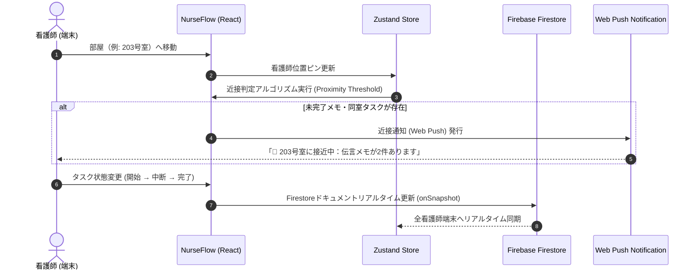

# NurseFlow - 看護師向けタスク・動線管理ツール 🏥✨

> **現場の歩数と認知的負荷を激減させる、スマート看護業務・動線最適化プラットフォーム**

[](https://react.dev/)
[](https://www.typescriptlang.org/)
[](https://vitejs.dev/)
[](https://tailwindcss.com/)
[](https://firebase.google.com/)
[](https://zustand-demo.pmnd.rs/)

---

## 📌 プロジェクト概要

**NurseFlow** は、医療現場における人手不足や多忙なマルチタスク、突発的なナースコール・割込業務による**看護師の物理的・精神的負荷を軽減するWebアプリケーション**です。

病棟内のリアルタイム位置情報・近接検知・インタラクティブな時間軸タイムライン・細粒度なタスク状態遷移（8〜10段階）を融合し、**「ムダな往復歩数の削減」** と **「次に何をすべきか迷わない認知負荷ゼロのUI」** を実現します。

### 🎯 想定ユーザー
- **看護師・チームリーダー・病棟管理者**: 現場のタスク可視化、チーム間の相互フォロー、効率的な動線計画に活用。
- **採用担当者・エンジニア**: 実務に即したドメインロジック設計、状態管理、UX・最適化アルゴリズムの実装例として確認。

---

## ✨ 主な機能一覧

| 機能カテゴリ | 主な機能と説明 |
| :--- | :--- |
| 📅 **タイムライン管理 & Drag & Drop** | `@dnd-kit` を活用した時間軸（15分/30分/60分表示）での直感的なタスクドラッグ＆ドロップ。患者別・タスク別のハイブリッドグルーピング対応。 |
| 🗺️ **病棟マップ & 近接通知** | 病棟マップ（Ward Map）上で看護師の位置ピンを可視化。同室・近接部屋に未完了メモ・タスクがある場合、自動でエリア接近検知し **Native Web Push通知** を配信。 |
| 🔄 **細粒度ステータス遷移（8〜10段階）** | 処置・記録それぞれの「未実施・開始・中断・再開・完了・Skipped（スキップ）」を厳密に制御。未実施時の理由モーダル保存とトレーサビリティを確保。 |
| 💡 **アンカーメモ連動・動線最適化 (Anchor Clustering)** | 時間制約のある重要処置（レッドアンカーメモ）の訪室に合わせて、同室・近隣部屋の低優先度タスク（ゴミ捨てや物品補充等）を同一枠に自動レコメンド。 |
| 🚨 **割り込みレジュームナビ & SOS機能** | 突発対応時の中断理由をスタック保存し、対応終了後に再開対象タスクを優先通知。看護師間のSOS要請や患者緊急呼出の全端末リアルタイム同期。 |
| 📋 **リーダーTODO & 申し送り管理** | チームリーダーからのダブルチェック指示、スレッド型経過記録、担当看護師へのタスクアサインと状況追跡。 |
| 📊 **アナリティクス & 業務ダッシュボード** | `Recharts` を用いた看護師ごとのストレス負荷度、タスク消化率、業務阻害要因（割り込み）の視覚的グラフ分析。 |
| 🎨 **UI/UX & PWA・オフライン対応** | 「Vital & Focus」「Serene & Calm」「Night Mode」の3つのカラーパレット切替。PWA対応とネットワーク遮断時のオフライン通知機能。 |

---

## 🏗️ システム構成 & シーケンス



---

## 🛠 使用技術スタック

### フロントエンド
- **コア**: [React 19](https://react.dev/), [TypeScript 5.9](https://www.typescriptlang.org/)
- **ビルドツール**: [Vite 8](https://vitejs.dev/)
- **状態管理**: [Zustand 5](https://zustand-demo.pmnd.rs/) (Single Source of Truth / セッション保持)
- **スタイル**: [Tailwind CSS v4](https://tailwindcss.com/), PostCSS, Custom Design System
- **Drag & Drop**: `@dnd-kit/core`, `@dnd-kit/sortable`, `@dnd-kit/utilities`
- **データ視覚化**: [Recharts 3](https://recharts.org/)
- **ガイド・チュートリアル**: Driver.js

### バックエンド & インフラ
- **Baas / Database**: [Firebase 12](https://firebase.google.com/) (Firestore, Authentication, PWA)
- **外部データ同期**: Google Apps Script (GAS) スプレッドシート連携API
- **通知**: HTML5 Native Notification API / Web Push

---

## 🚀 ローカル環境での起動手順

### 1. 前提条件
- **Node.js**: v18.0.0 以上
- **npm**: v9.0.0 以上

### 2. リポジトリの取得とディレクトリ移動

```bash
git clone https://github.com/your-username/nursing-app-proto-v2.git
cd nursing-app-proto-v2/nurse-task-web
```

### 3. パッケージのインストール

```bash
npm install
```

### 4. 環境変数の設定 (任意 / Firebase連携時)

`.env` ファイルを `nurse-task-web` のルート直下に作成し、Firebaseプロジェクトの設定情報を記述します。（※デモモード・ゲストログイン時はローカルシードデータで即座にお試しいただけます）

```env
VITE_FIREBASE_API_KEY=your_api_key
VITE_FIREBASE_AUTH_DOMAIN=your_auth_domain
VITE_FIREBASE_PROJECT_ID=your_project_id
VITE_FIREBASE_STORAGE_BUCKET=your_storage_bucket
VITE_FIREBASE_MESSAGING_SENDER_ID=your_sender_id
VITE_FIREBASE_APP_ID=your_app_id
```

### 5. 開発サーバーの起動

```bash
npm run dev
```

起動後、ブラウザで [http://localhost:5173](http://localhost:5173) にアクセスしてください。

### 6. その他のスクリプト

```bash
# プロダクションビルド
npm run build

# ビルド成果物のローカルプレビュー
npm run preview

# ESLint による静的解析
npm run lint
```

---

## 💡 工夫した点・こだわり

### 1. 認知負荷を極小化するUI/UX設計 (Zero-State & One-Hand Action)
- 医療現場では両手が塞がっているシーンや、一瞬の判断が求められる場面が多いため、**親指一本で押しやすいタスクカードとダイナミックボタン** を採用。
- 今実行すべきタスクのみを最前面に浮き彫りにし、思考の割り込みが発生しても「次に行うべき操作」に迷わないZero-Stateデザインを貫いています。

### 2. アンカーメモ連動・動線最適化アルゴリズム (Anchor Clustering)
- 定時投与や処置などの「絶対約束メモ（レッドアンカー）」を軸に、同室・近隣部屋に溜まっている未割り当ての軽タスクを15分枠内に自動集約する `optimizeTimeline` アルゴリズムを構築。病棟内の不要な往復歩数を大幅に削減します。

### 3. Firestore × Zustand の超爆速レスポンスと状態同期
- Firebase Firestore の `onSnapshot` リアルタイム同期と Zustand のローカル状態を組み合わせ、**通信遅延を感じさせないサクサク感** と **チーム全員でのデータ一貫性** を両立。
- ゲストログイン時と正規ログイン時でデータが混ざらない厳密なクエリフィルタリングとゴーストタスク排除ロジックを搭載しています。

---

## 📄 ライセンス

This project is licensed under the MIT License.
